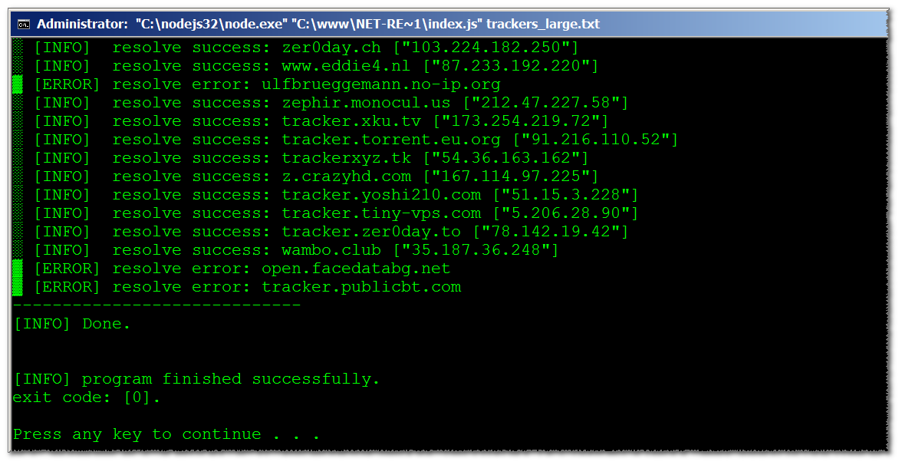

<h1> a <em>NodeJS</em> net-resolver tool.</h1>

Resolve host-names to IPs. Fast.

either use local-machine's way of DNS resolving (HOSTS, DNS service, gateway),  
or (with a little, internal, tweak) Google-DNS or OpenDNS services. 

  

support for full URLs, so you can dump a large amount of text witout the need to extract the host-name yourself.
it will add the same URL with IP (IPv4) instead of the host-name.  

efficient - only resolve each host-name to IP <strong>once</strong>.  

<em>copy&amp;paste-friendly</em> output for Windows (uTorrent too with an additional of <code>\r\n</code> for each line).  

generates a new file with the <code>_resolved</code> suffix added to its-name. same extension.  

the output is uniquified, but not sorted,  
each URL and resolved URL only appears once,  
and the order of the input is preety-much the same. 

dead-URLs will not be added.

Note that IP-host-names are being added to the list, as-is (and then the whole list is uniquified). 

Non-blocking, parallel DNS-resolving using a modified NodeJS resolve4.  

Nice verbosed-output while it works..  
  

You can see the example files <code>trackers.txt</code> and <code>trackers_large.txt</code> to see how the whole thing works for "manually resolving" torrent-trackers to URLs with IPs. You need to add another <code>\r\n</code> EOL for each line to paste it to uTorrent, so uTorrent will be able to use each as a target. 
Here are some workable torrent trackers: https://gist.github.com/eladkarako/07157866f7e57279a24ef5093e133da3#file-torrents_trackers-txt 